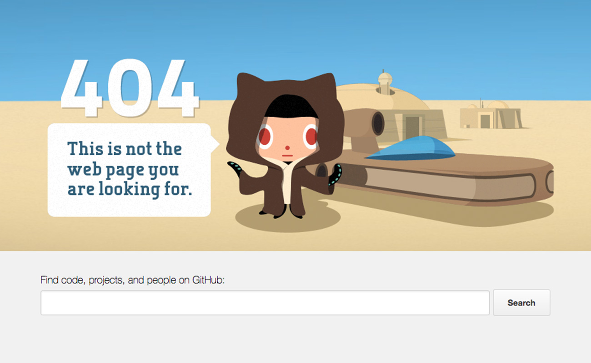
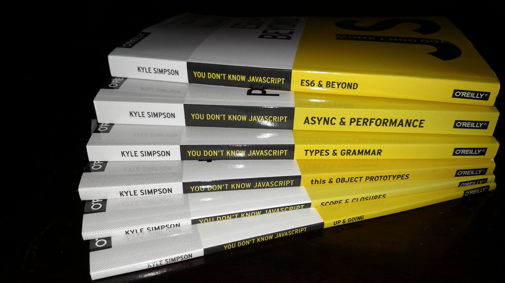

<!-- .slide: class="center" -->
# Javascript
## orientado a objetos 
# para dummies

---

<!-- .slide: data-background="./assets/img/frameworks-bg.png" -->

---

<!-- .slide: class="center" -->
<!-- .slide: data-background="./assets/img/frameworks-bg.png" -->
[](https://twitter.com/getify/status/997190883622735874 )
<div class="fragment fade-in">
  <span class="over-left"></span>
  <span class="over-right"></span>
</div>

---

<!-- .slide: data-autoslide="3500" -->
<!-- .slide: data-background="./assets/img/giphy.gif" -->

---

<!-- .slide: data-background="./assets/img/frameworks-bg.png" -->


---

<!-- .slide: data-background="./assets/img/solar-bg.jpg" -->
# Pérdida de conocimiento

# &nbsp;
# &nbsp;
# &nbsp;

---

<!-- .slide: class="center" -->
<!-- .slide: data-background="./assets/img/frameworks-bg.png" -->
[](https://twitter.com/SaraSoueidan/status/999645120155746304)

---

<!-- .slide: class="center" -->
<!-- .slide: data-background="./assets/img/frameworks-bg.png" -->
[](https://twitter.com/onion2k/status/999649790110654469)

---

<!-- .slide: data-background="./assets/img/frameworks-bg.png" -->
```js
<script type="text/javascript">
  function mostrarBotones() {
    $('a#mostrarBotones').hide();
    $('a#ocultarBotones').show();
    $('#button1').show();
    $('#button2').show();
  }
  function ocultarBotones() {
    $('a#mostrarBotones').show();  
    $('a#ocultarBotones').hide();
    $('#button1').hide();
    $('#button2').hide();
  }
</script>
```

---

<!-- .slide: data-background="./assets/img/pollution.jpg" -->

---

<!-- .slide: data-background="./assets/img/frameworks-bg.png" -->
```js
<script type="text/javascript">
  function mostrarBotones() {
    $('a#mostrarBotones').hide();
    $('a#ocultarBotones').show();
    $('#button1').show();
    $('#button2').show();
  }
  function mostrarBotones2() {
    // El imperio contraataca
  }
  function mostrarBotonesPie() {
    // Nota: no es el pie de la página, ese es mostrarBotones()
    // Es el pie de un formulario de contacto del aside
  }
</script>
```

---

# IIFE

#### Immediately - invoked function expression

```js
(function (global) {
  ...
})(window);
```

---

### Pero no me engañas...

```js
  $(document).ready(function(){
    $('#button1').on('click', function(){
      $('#result').load('ajax/list-people.html', function() {
        $('#form').slideUp()
      });
    })
    $('#button2').on('click', function(){
      $('#result').load('ajax/list-brands.html', function() {
        $('#form').slideUp()
      });
    })
  });
```
## ...el cuerpo te pide objetos a gritos

---

# Javascript 
# orientado a objetos

---

#### Herencia
#### Cohesión
#### Abstracción
#### Encapsulamiento
#### Polimorfismo
#### Acoplamiento

---

# Clases
# &nbsp;

---

# ~~Clases~~
# &nbsp;
---

# ~~Clases~~
# Prototipos

---

<ul class="square-grid">
  <li>Clase</li>
  <li>Instancia</li>
  <li>Prototipo</li>
  <li>Objeto</li>
</ul>

---

<ul class="square-grid">
  <li>Clase <small>estática</small></li>
  <li>Instancia <small>dinámica</small></li>
  <li>Prototipo <small>dinámico</small></li>
  <li>Objeto <small>dinámico</small></li>
</ul>

---

<ul class="square-grid">
  <li>Clase</li>
  <li>Taxonomia</li>
  <li>Prototipo</li>
  <li>Comportamiento</li>
</ul>

---

# Cómo definir objetos en JS

---

## Elige tu propia aventura

* **literal**: {}
* **constructor**: new
* **class** (ES2015): new
* **Object.create()**
* **función factoría**

---

# Conocer el tipo de un objeto

**instanceof** (sólo si usas **new**)

```js
myObj instanceof MiConstructor
```

**isPrototypeOf()**

```js
objetoPrototipo.isPrototypeOf(myObj)
```

===

```js
Object.getPrototypeOf(myObj) === objetoPrototipo
myObj.__proto__ === objetoPrototipo
```

---

<!-- .slide: data-background="./assets/img/letscode.gif" -->
# Al lío
# &nbsp;
# &nbsp;
# &nbsp;

---

### ¿Seguís despiertos?


---

## Mis favoritos

* **literal**: {}
* **Object.create()**
* **Object.assign()**
* **función factoría**
* ...

---

# Gracias

---

**$ whoami**

&nbsp;

**David Marchena**

**@dmarchena**

---